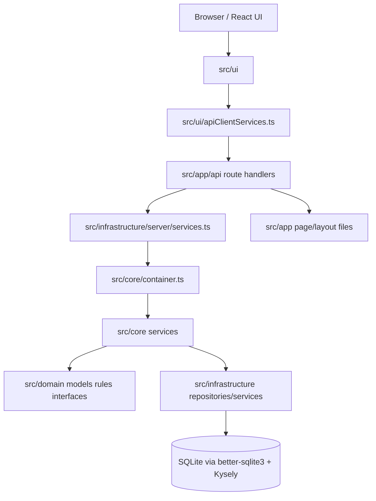
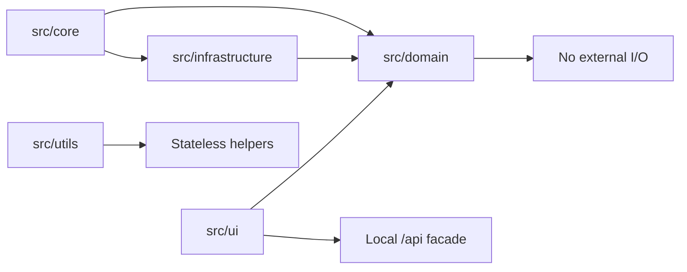
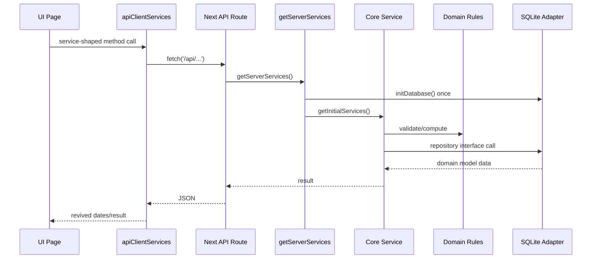

# Architecture Overview

PlayMoreTCG is a Next.js App Router e-commerce application organized with Joy-Zoning layers.

## Layer Diagram

## Dependency Rules

- Domain owns pure models, repository contracts, errors, and rules.
- Core orchestrates use cases and composes domain behavior with adapters.
- Infrastructure implements persistence, auth, payment, server sessions, and SQLite initialization.
- UI renders and dispatches intentions through API facades/hooks.
- App Router files are framework boundaries for pages and API routes.

## Verified Runtime Flow

## Logic Density

Observed primary logic hotspots:

- `src/domain/rules.ts`: validation, stock, cart, and order pure rules.
- `src/core/OrderService.ts`: checkout orchestration and rollback/reconciliation handling.
- `src/core/container.ts`: composition root and singleton/factory service creation.
- `src/infrastructure/sqlite/database.ts`: schema creation and SQLite pragmas.
- `src/ui/apiClientServices.ts`: browser HTTP facade and date revival.
- Admin/customer pages under `src/ui/pages/**`: interactive presentation flows.

## Structural Mentorship

When adding behavior, first decide whether it is a rule, orchestration step, adapter concern, or presentation concern. Put validation and deterministic calculations in Domain, use Core for multi-step use cases, keep SQLite/fetch/session details in Infrastructure or route handlers, and keep UI focused on rendering and event dispatch.
